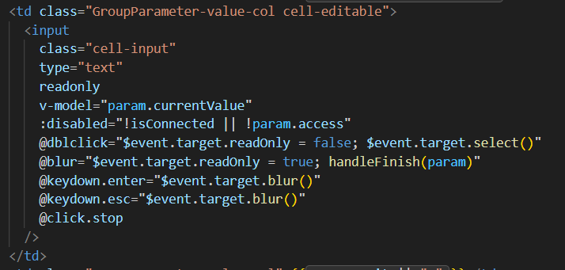

# 表格内置input
今天在写需求的时候有一个是把表格中的读写选项由弹窗确认改为直接在表格中双击变为input编辑，最开始的时候想直接在表格中加input，但是发现好像不是客户需要的那种默认是表格，双击变成input（因为如果直接写input的话，单击就会直接改变），所以就有了这个：


解释：
```js
readonly:保证input处于只读属性
@dblclick="$event.target.readOnly = false; $event.target.select()":双击时input变为可编辑状态
@blur="$event.target.readOnly = true; handleFinish(param)":失去焦点时input变为只读状态并执行后续逻辑
@keydown.enter="$event.target.blur()":回车时失去焦点
@keydown.esc="$event.target.blur()":esc时失去焦点
@click.stop:阻止点击事件冒泡
```
接下来就是css了，调整样式保持input的外观和表格单元格一致,另外要对单击和双击时的样式做单独处理
```css
.cell-input[readonly] {//cell-input属性&&只读属性
  cursor: default;
  user-select: none;
}
.cell-input:focus:not([readonly]) {//cell-input属性&&非只读属性&&聚焦
  border-color: #409eff;
  background: #fff;
  box-shadow: 0 0 0 2px rgba(64, 158, 255, 0.15);
}
